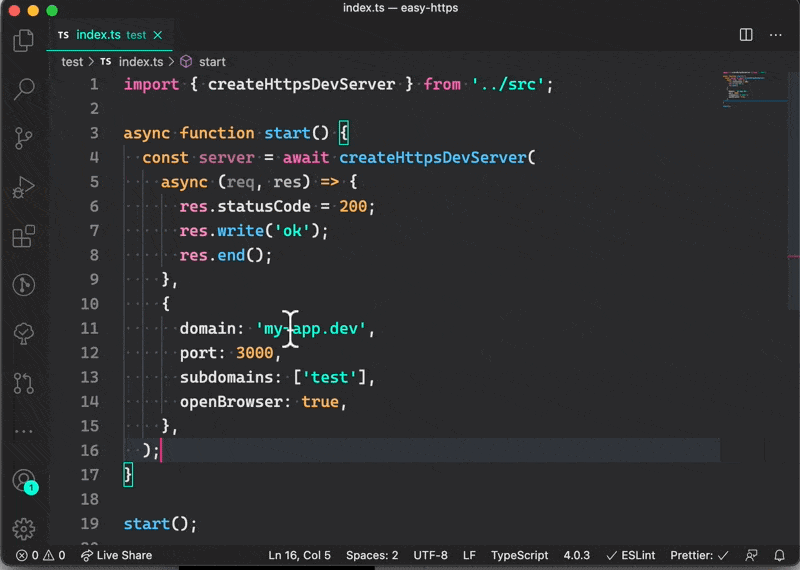

# easy-https

Zero config, one step local https server with custom local domain.

What it does?

- Will automatically add proper domain entries to `/etc/hosts`
- Will ask you for admin password only if needed on first run / domain change
- Will prepare https certificates for given domains
- Will trust those certificates on your local machine
- Will open the browser on start pointing to your local server https url

Demo



## Useage with plain node:

```ts
import { createHttpsDevServer } from 'easy-https';

async function start() {
  const server = await createHttpsDevServer(
    async (req, res) => {
      res.statusCode = 200;
      res.write('ok');
      res.end();
    },
    {
      domain: 'my-app.dev',
      port: 3000,
      subdomains: ['test'], // will add support for test.my-app.dev
      openBrowser: true,
    },
  );
}

start();
```

## Useage with Express

```ts
import { createHttpsDevServer } from 'easy-https';
import express from 'express';
const app = express();

createHttpsDevServer(app, config);
```

## Useage with Next.js

```ts
import { createHttpsDevServer } from 'easy-https';
import next from 'next';
import { parse } from 'url';

const app = next({ dev: IS_DEV });
const requestHandler = app.getRequestHandler();

async function start() {
  await app.prepare();

  const { server, url } = await createDevServer((req, res) => {
    const parsedUrl = parse(req.url!, true);
    requestHandler(req, res, parsedUrl);
  }, config);

  logger.log(`Server ready. 🚀`);
}

start();
```

## Useage API, avaliable options

```ts
interface ServerConfig {
  // Main Local domain
  domain: string;
  // Local port to listen on
  port: number;
  // List of subdomains
  subdomains?: string[];
  // If should open web browser when server is ready
  openBrowser?: boolean;
  // Custom logger - defaults to console.info
  logger?: (...args: any) => void;
}

function createHttpsDevServer(
  // Normal node.js (req, res) handler.
  handler: RequestListener,
  config: ServerConfig,
): Promise<{
  // https local server url.
  url: string;
  // Node https server instance
  server: Server;
}>;
```

## Notes

**NEVER USE IN PRODUCTION**

This lib is intended to make it easy to setup local https server with custom local domain. It is not meant to be secure in any way.

It is not tested on Windows. If you want, feel free to send proper PR adding Windows support.

## Licence

Mit.
